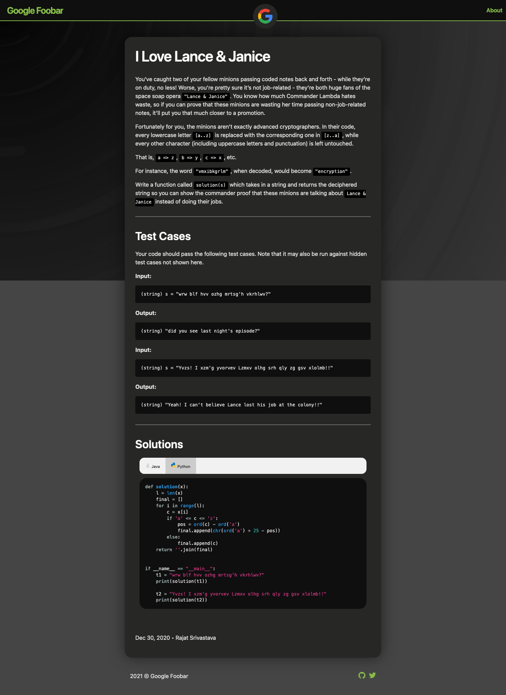

This repository provides some of the questions asked in google foobar challenge, and their solutions

Check out [docs](https://rajat19.github.io/foobar)

### Questions
- Level 1
  - [I Love Lance and Janice](https://rajat19.github.io/foobar/i-love-lance-janice)
  - [Braille Translation](https://rajat19.github.io/foobar/braille-translation)
- Level 2
  - [Lovely Lucky Lambs](https://rajat19.github.io/foobar/lovely-lucky-lambs)
  - [Elevator Maintenance](https://rajat19.github.io/foobar/elevator-maintenance)
- Level 3
  - [The Grandest Staircase Of Them All](https://rajat19.github.io/foobar/the-grandest-staircase-of-them-all)
  - [Bomb Baby](https://rajat19.github.io/foobar/bomb-baby)

### Theme
The theme used to create this static website is [jekyll-theme-leaf](https://github.com/SupunKavinda/jekyll-theme-leaf)